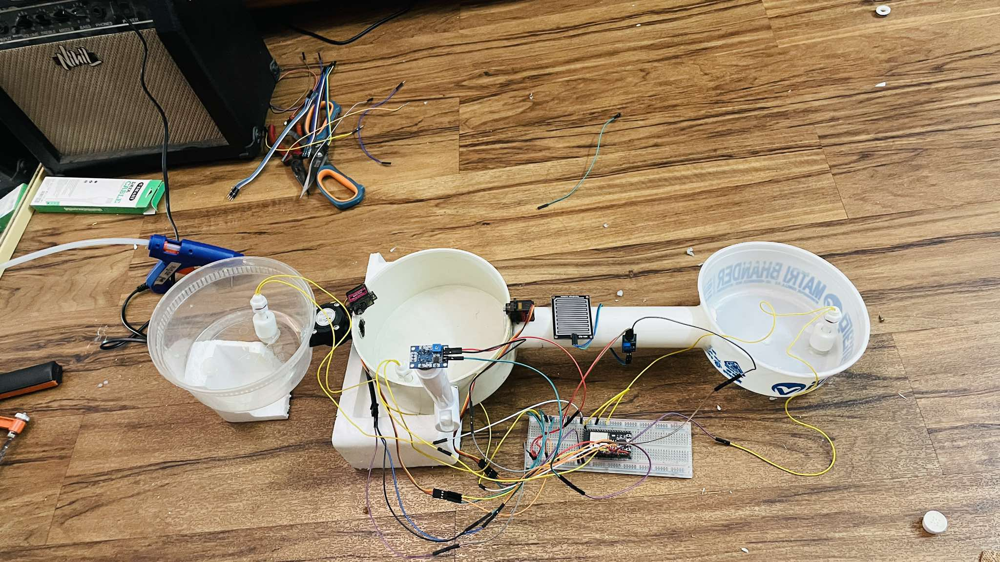

# IoT_Drainage_Monitoring_System-
# ESP32 Smart Drainage Monitoring System

This project monitors drain water levels, rain intensity, gas buildup, and flow rate using an ESP32 and sends real-time data to Blynk. Servo-driven gates automatically open/close based on overflow conditions.

## Prototype Hardware

## Features
- Drain 1/2/3 water level monitoring
- Gas sensor monitoring for clog detection
- Rain sensor integration
- Flow sensor real-time measurement
- Servo-based gate automation
- Alerts through Blynk (overflow, low flow, gas levels)

## Code Included
- `code/drain_maintenance_system_firmware.ino` (working non-FreeRTOS version)

## Next Steps
- Implement FreeRTOS version
- Add database logging
- Add OTA updates
